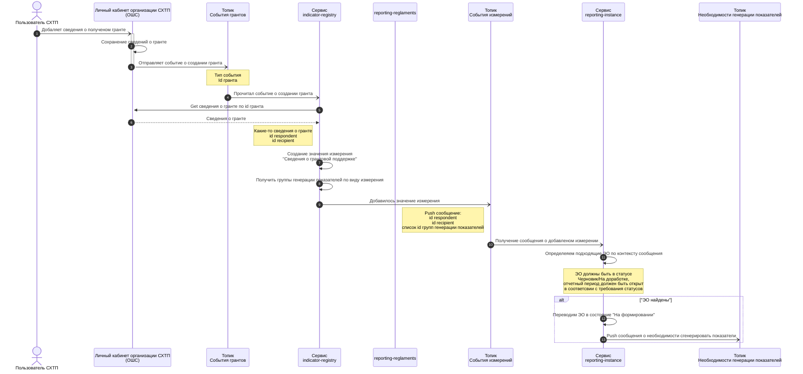

## Генерация показателей при добавлении гранта в личном кабинете
### Предусловия
1. Сбор отчетности открыт для формирования комплектов отчетов
2. В системе сформированны отчеты по сбору для организации
3. Отчеты находятся в статусе черновик/На доработке
4. Группа генерации показателей настроена
5. В комплекте указана группа генерации показателей
### Схема процесса

